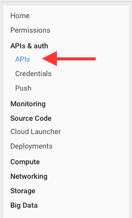
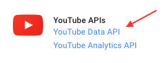
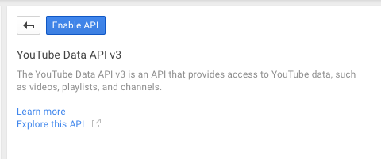
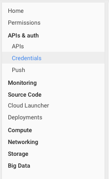
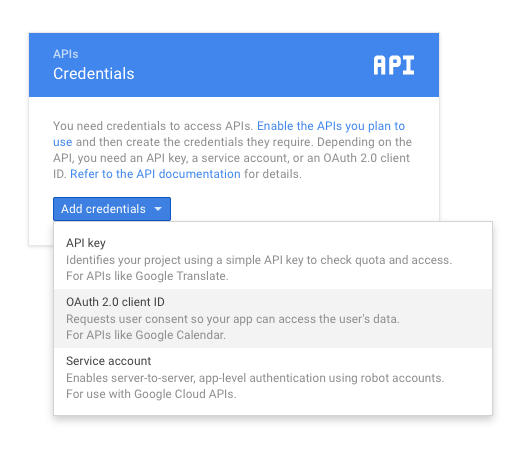
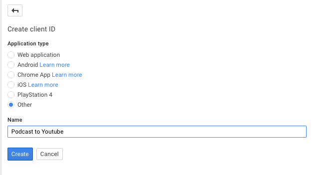
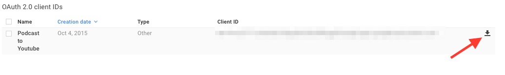

Take your existing podcast feed and upload it to Youtube. The script will automatically generate video .mkv files from your audio files with the episode image as a still image. As far as possible metadata from the podcast feed will be added to the Youtube video.

All uploaded videos are private by default, so you can review them before publishing.

**This is very early alpha. Still more a POC. Use with care.**

## Usage

ffmpeg is required to create the video files
```
apt-get install ffmpeg
```

ruby is required to run the script
```
apt-get install ruby ruby-dev zlib1g-dev
```

Download the script and install the required gems via bundler
```
git clone https://github.com/funkenstrahlen/podcast-to-youtube.git
gem install bundler
cd podcast-to-youtube
bundle
```

Go to [Google Developer Console](https://console.developers.google.com/) and login to create API credentials.

Go to the API section


Go to Youtube API


Enable the API


Go to the credentials section


Add new OAuth2 credentials


Configure them


Download the credentials file and place it in this project `config` folder.


Rename the credentials file
```bash
mv client_secret_12345678-asdljkahsdlkjasdlkjasd.apps.googleusercontent.com.json client_secret.json
```

Think about your upload limit! Videos with more than 15 minutes can only be uploaded if your Youtube accaunt is linked to your phone numer.

run the script
```
ruby podcast-to-youtube.rb
```

You will have to open an OAuth2 Url in your browser to allow the script to access your Youtube account. Paste the authentication code you receive into the script prompt.